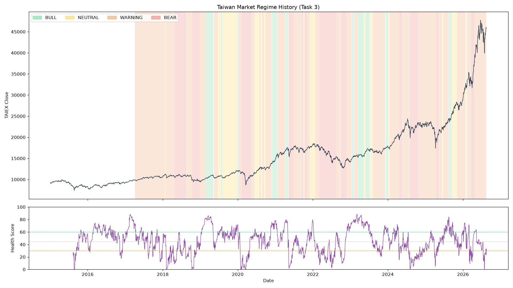

# Taiwan Equity Quantitative Research System


> A multi-factor stock-selection strategy combined with a rule-based market-regime
> risk overlay, built end-to-end on real Taiwan equity data (2012–present). Every
> number in this document is reproducible from a file in `reports/` — where a test
> failed or a factor showed no signal, that result is reported here rather than
> removed.

---

## 1. Overview

This system selects a long-only portfolio of ~30 Taiwan-listed equities every 120
trading days, ranking the top-300 most liquid, profitable stocks by an
IC-weighted composite of five factors (momentum, value, revenue growth, low
volatility, dividend yield). A separate, independently-computed **market regime
detector** — combining a market-breadth health score, a Gaussian HMM, and a
LightGBM crash-probability model — scales portfolio exposure between 10% and
100% depending on how healthy the market currently looks. The design goal is
not to maximize backtested return; it is to build a pipeline where every
factor, every regime rule, and every performance number has been tested against
real data and honestly reported, including the results that did not work.

---

## 2. Architecture

The system was built in eight sequential stages. Each stage is a real,
independently testable module — later stages depend only on the outputs of
earlier ones (e.g. `regime/` never imports from `strategy/`, only the reverse).

| # | Layer | What it does | Key modules | Status |
|---|-------|--------------|-------------|:---:|
| 1 | **Data Pipeline** | FinMind ingestion of price/valuation/revenue/institutional-flow/margin/index data into SQLite, with idempotent upserts, a checkpoint-based resumable downloader, a cross-process download lock, and 402-quota-exhaustion auto-hibernate/resume | `data_pipeline/schema.py`, `loader.py`, `download_institutional.py`, `download_supplementary.py`, `download_lock.py`, `finmind_common.py` | ✅ Complete |
| 2 | **Factor Library** | Modularized, IC-tested factor definitions with a single-signature interface (`factor(data) -> DataFrame`) | `strategy/factors/{base,style,taiwan}.py` | ✅ Complete |
| 3 | **Regime Detection** | 0–100 market health score + Gaussian HMM bear-probability + LightGBM crash-probability, combined into a hysteresis-smoothed BULL/NEUTRAL/WARNING/BEAR classification | `regime/{indicators,health_score,hmm_detector,ml_alert,regime_engine,plot_regimes}.py` | ✅ Complete |
| 4 | **Regime Integration** | Regime-conditional factor weights and continuous exposure scaling wired into the backtest engine; turnover decomposition | `strategy/quant_layer2.py` (`REGIME_FACTOR_WEIGHTS`), `strategy/portfolio.py` | ✅ Complete |
| 5 | **ML Factor Synthesis** | LightGBM, expanding-window walk-forward (retrained yearly), as an alternative, non-linear factor combiner | `strategy/ml_composite.py` | ✅ Complete |
| 6 | **Validation Framework** | Walk-forward OOS testing, 4-way ablation study, Deflated Sharpe Ratio / bootstrap significance testing, return-attribution decomposition | `strategy/{walk_forward,ablation,significance,attribution,benchmark_concentration}.py` | ✅ Complete |
| 7 | **Research Integrity** | Survivorship-bias quantification attempt, rolling factor-decay monitoring, ADV-based capacity analysis | `data_pipeline/survivorship.py`, `regime/decay_monitor.py`, `strategy/capacity.py` | ✅ Complete |
| 8 | **Automation** | Daily incremental data refresh (top-300 liquid universe), regime signal computation, live position generation, LINE/Notion notification (auto real-send / dry-run) | `automation/daily_update.py`, `automation/notifier.py`, `.github/workflows/daily_quant.yml` | ✅ Complete |

101/101 unit tests pass across all eight layers (synthetic-data tests validating
logic correctness, not strategy performance).

---

## 3. Factor Methodology

All IC statistics below are cross-sectional Spearman rank correlations between
the factor value and each stock's forward 20-trading-day return, computed on
the top-300-liquidity universe over the full available sample
(2015–2026-08, extended backtest range 2012–2026 for regime detection).

### 3.1 Factors currently in the live composite

| Factor | Definition | Economic logic | IC (mean) | ICIR | Reference |
|---|---|---|---:|---:|---|
| **Momentum** (`momentum`) | 52-week-high price ratio | Investors anchor to the 52-week high and underreact to good news once a stock approaches it, causing slow price discovery | 0.0378 | — | George & Hwang (2004); Jegadeesh & Titman (1993) |
| **Value** (`value`) | 0.5×(1/PER) + 0.5×(1/PBR) | Classic value premium — cheap-on-fundamentals stocks are systematically underpriced relative to risk/behavioral biases | 0.0221 | — | Fama & French (1993, 2015) |
| **Revenue growth** (`rev_yoy`) | YoY monthly revenue growth, 40-day publication-lag shifted | Market underreacts to real fundamental growth signals, similar to post-earnings-announcement drift | 0.0199 | — | Bernard & Thomas (1989) |
| **Low volatility** (`low_vol`) | Inverse 60-day realized volatility | Leverage-constrained investors overpay for lottery-like high-volatility stocks, compressing their forward returns (the "low-vol anomaly") | 0.0349 | — | Ang, Hodrick, Xing & Zhang (2006); Frazzini & Pedersen (2014) |
| **Dividend yield** (`div_yld`) | Trailing dividend yield | Proxy for mature, cash-flow-stable, market-underweighted companies — a value/quality factor in the same family as HML | **0.0424** | **0.268** | Fama & French (1993) |

Weights are primarily assigned dynamically by 252-day rolling \|IC\| (recomputed
daily, renormalized across whichever factors currently have data); the values
above are the IC-proportional **fallback weights** used only when insufficient
rolling history exists: `momentum 0.24 / value 0.14 / rev_yoy 0.13 / low_vol
0.22 / div_yld 0.27`.

`div_yld` was **formally adopted into the composite on 2026-09-03** — it is the
highest-IC, highest-ICIR factor of the five, and the only one with a positive
IC in every one of the 12 tested years (2015–2026). It had existed in the
codebase since before this project's Task 1–9 initiative but had never been
through a formal IC review; that gap was closed during Task 8's
pre-acceptance audit (see `docs/DECISIONS.md`, "Task 8 驗收前疑點排查").

### 3.2 Factors tested and honestly excluded

Research integrity in this project means a negative result is reported with
the same rigor as a positive one. Three factors were formally IC-tested and
removed from the live composite; their code and data remain in the repository
for transparency and possible future re-evaluation.

| Factor | Definition | Why it was hypothesized to work | Test result | Verdict |
|---|---|---|---|---|
| `mom_120` | 120-day momentum | A longer-horizon momentum variant, complementary to the 52-week-high signal | IC 0.0212, ICIR 0.128, but **0.692 cross-sectional rank correlation with the primary `momentum` factor** — i.e. it is largely a redundant, weaker copy of an existing signal, not an independent one | **Removed** (2026-09-03) |
| `inst_flow` | 60-day normalized foreign + trust investor net buying | Information-advantage hypothesis: institutional investors trade ahead of price moves | IC 0.0034, ICIR 0.037, IC>0 only 52.1% of the time, tested across 4 independent checks (raw-vs-normalized, pre/post full-history backfill, 5/50-record API spot-check, 5/10/20-day horizons, year-by-year 2015–2026) — no window, year, or specification produced a stable signal | **Removed** (2026-08-18) |
| `margin_usage` | −1 × 20-day retail margin balance change | Rising margin balance signals speculative excess and predicts mean-reversion | IC −0.0039, ICIR −0.047, IC>0 only 47.9% of the time (linear test); independently re-tested with a non-linear LightGBM model on the full market — ranked **last in feature importance in all 9 walk-forward years** (rank std = 0, the only factor with zero year-to-year variation) | **Never adopted** — retained only as a decay-monitoring / ML-feature diagnostic, not in the linear composite |

Full write-ups: `reports/factor_negative_findings.md` (inst_flow/margin_usage,
four rounds of independent verification), `docs/DECISIONS.md` (mom_120/div_yld,
git-archaeology of when each factor was introduced relative to this project's
2026-08-17 start date).

---

## 4. Regime Detection

`regime/` is an independently-computable module (it is only ever *called by*
the strategy layer, never the reverse) that classifies each trading day into
one of four states and maps that state to a suggested portfolio exposure.

**Health score (0–100)** — a weighted composite of 7 components, each converted
to a rolling-252-day percentile before combining:

| Component | Weight | Direction |
|---|---:|---|
| Realized volatility percentile | 18 | inverted (lower vol = healthier) |
| Market breadth (advancers − decliners) | 22 | — |
| New highs − new lows | 13 | — |
| Average pairwise stock correlation | 13 | inverted (lower correlation = healthier) |
| Downside return asymmetry | 13 | inverted |
| Margin-squeeze ratio | 12 | — |
| Margin-capitulation bonus | +9 | flat bonus when triggered |

(Core components sum to 91; the capitulation bonus brings the maximum to 100.
An 8th candidate component, price-trend-vs-200-day-MA, was tested at weight 20
and **rejected** after it only improved the 2023–24 BULL-rate acceptance
criterion from 18.9% to 23.9% — short of the adoption bar — see
`reports/health_score_breadth_divergence.md`.)

**Three-way vote** (all thresholds are AND-combined per state):

```
health ≥ 60  AND  p_bear < 0.3  AND  crash_prob < 0.3   → BULL     (exposure 1.0)
health ≥ 45  AND  p_bear < 0.5                          → NEUTRAL  (exposure 0.7)
health ≥ 30  OR   p_bear < 0.7                          → WARNING  (exposure 0.4)
otherwise                                                → BEAR     (exposure 0.1)
```

- **`p_bear`** — a 3-state Gaussian HMM fit on an expanding window (refit
  monthly, minimum 504 days of history), Hamilton (1989).
- **`crash_prob`** — a LightGBM classifier predicting "TAIEX return over the
  next 20 days < −5%", retrained every year on an expanding window
  (walk-forward, no look-ahead).

An **asymmetric hysteresis** filter (18 days of confirmation to upgrade to a
better state, only 3 days to downgrade) suppresses noise-driven flip-flopping
without slowing crisis detection — the 2020-02/03 COVID crash and full-year
2022 bear market are both detected at full speed since detection relies on the
fast downgrade path, unaffected by the slower upgrade path.

**Known reliability limitation of the third vote (honestly disclosed, not
fixed)**: `crash_prob`'s pooled out-of-sample AUC across all 13 walk-forward
years (2014–2026) is **0.493** (n=3,068, 272 positive labels) — statistically
indistinguishable from a coin flip. This is not a code bug (`predict_proba`
class ordering was verified correct in the worst years) and not fixable by
simple regularization (early-stopping was tested and produced inconsistent,
unstable results). The root cause is that the crash label (a 20-day rolling
window) produces highly autocorrelated labels from very few truly independent
crash episodes per year (1–6 in most years, only 1 in 2023 and 2024), making
any single year's AUC estimate extremely high-variance. The full diagnosis —
including the year-by-year AUC table, the independent-episode breakdown, and
the pooled-AUC computation — is in `reports/ml_alert_reliability_diagnosis.md`.
**Decision**: this limitation is documented rather than silently ignored, but
`classify_regime_raw()`'s formula was deliberately **not** changed, because
doing so would invalidate the already-accepted Task 3–6 validation numbers
that were computed on the current formula; `crash_prob` is one of three
AND-combined votes, so its near-random behavior means it occasionally
misfires a boundary call rather than corrupting the whole classification.



---

## 5. Performance

All numbers below come directly from files in `reports/`. Where a result is a
frozen point-in-time report (Task 6, computed as of 2026-04-17) versus the
live, continuously-updating pipeline (Task 8, `data_end=today`), both are
shown and reconciled rather than the newer number quietly replacing the older
one.

### 5.1 Task 2 baseline (dynamic IC-weighted composite, no regime overlay)

This is the version all Task 6 statistical tests below are computed against.

| Metric | Value (as of 2026-04-17, frozen) |
|---|---:|
| Total return | +92.1% |
| Annualized return | +6.5% |
| Sharpe ratio | 0.39 |
| Max drawdown | −24.9% |
| Annual turnover | 255.2% |

The daily automation's first real full pipeline run (2026-08-28 data,
generated 2026-08-29, *before* the factor fix in Section 3.1 was made) showed
**total return +129.6%, CAGR +8.0%, Sharpe 0.51, MDD −24.9%, turnover 255.5%**
— an unexplained-looking +37.5-point jump from the 92.1% baseline above that
was flagged and fully investigated before Task 8 was accepted (`docs/DECISIONS.md`,
"Task 8 驗收前疑點排查"). A controlled 2×2 decomposition (factor composition
× backtest end-date, each varied independently) showed the jump is **not**
a discrepancy requiring further action: **+31.9 of the +37.5 points come from
4.3 additional months of real trading days** alone (TAIEX rose +25.9% from
36,804 to 46,331 in that window; compounding the original 92.1% return by
that market move reproduces 129.6% almost exactly: 1.921 × 1.195 = 2.296),
and only **+5.6 points come from the `mom_120`→`div_yld` factor fix** itself
(92.1%→97.7% at the original end-date). Recomputed with **both** the current
factor composite *and* the same extended end-date — i.e. what the pipeline
produces today — the figures are **total return +136.5%, CAGR +8.3%, Sharpe
0.54**. Task 6's original 92.1% report is not stale or wrong; it is a correct
snapshot as of 2026-04-17, and any live, continuously-updating pipeline's
headline numbers will keep drifting upward from that snapshot as long as the
underlying market keeps rising — that drift is expected behavior, not an
error.

### 5.2 Walk-Forward Out-of-Sample Validation (Task 6a)

Genuine train/test split: factor weights for year *y* are computed only from
data in `[2015-01-01, y-1]`, frozen, then applied unchanged to year *y*.

| Year | Annual Return | Sharpe | Max Drawdown | Turnover |
|---|---:|---:|---:|---:|
| 2020 | +2.2% | 0.040 | −26.3% | 343% |
| 2021 | +25.9% | 1.684 | −11.8% | 317% |
| 2022 | −13.3% | −1.103 | −23.6% | 342% |
| 2023 | +18.6% | 1.969 | −7.9% | 366% |
| 2024 | +7.2% | 0.438 | −9.1% | 222% |
| 2025 | −1.2% | −0.156 | −18.5% | 249% |

**Overall OOS (chained daily): +37.8% total, +5.7% annualized, Sharpe 0.288,
MDD −26.3%, 4/6 positive years** — passes the ≥4/6 acceptance criterion.

### 5.3 Ablation Study (Task 6b) — same conditions, only the ranking method / regime overlay changes

| Version | Description | Total Return | CAGR | Sharpe | MDD | Turnover |
|---|---|---:|---:|---:|---:|---:|
| A | Fixed weights, no regime | +68.7% | +5.1% | 0.301 | −24.2% | 223.8% |
| B | Fixed weights + regime exposure | +14.8% | +1.3% | −0.054 | −11.1% | 72.8% |
| C | Dynamic IC weights + regime exposure | +17.2% | +1.5% | 0.011 | −10.8% | 76.0% |
| D | ML composite + regime exposure | +10.1% | +1.3% | −0.089 | −10.1% | 64.4% |

- **B vs A drawdown improvement ≥25%**: 54.2% actual → ✅ **pass**
- **B vs A Sharpe ≥ A − 0.1** (i.e. ≥ 0.201): −0.054 actual → ❌ **fail**

The regime overlay dramatically reduces risk (MDD and volatility both cut by
more than half) but sacrifices absolute return during this sample's historic
bull run, because BULL state — full 100% exposure — is confirmed on only
**1.9% of all trading days across 2012–2026** (the health-score/hysteresis
design is deliberately conservative about declaring "everything is fine").
This is a real, honestly-measured risk/return trade-off, not a bug.

### 5.4 Statistical Significance (Task 6c)

Tested against the Task 2 baseline (annualized 6.46%, Sharpe 0.393, 2,627
trading days, n_trials=8 for the 8 real strategy variants actually built and
backtested in this project).

| Test | Result | Significant? |
|---|---|:---:|
| Deflated Sharpe Ratio (Bailey & López de Prado, 2014) | 0.4190 | ❌ No (threshold 0.95) |
| Sharpe 95% CI (Lo, 2002) | [−0.056, 1.132] | ❌ No (contains 0) |
| Bootstrap p-value vs. TAIEX buy-and-hold (10,000 resamples) | p = 0.0272 | ✅ **Yes — but negative**: the strategy significantly **underperforms** the TAIEX by ~7.4 annualized percentage points |

**This underperformance finding is reported alongside its full follow-up
context, not in isolation.** A dedicated diagnosis
(`strategy/benchmark_concentration.py`,
`reports/benchmark_concentration_analysis.md`) asked whether "losing to TAIEX"
reflects genuinely poor stock-picking or simply the fact that TAIEX is a
market-cap-weighted index dominated by a single mega-cap stock (TSMC):

| Benchmark | Benchmark Total Return | Strategy vs. Benchmark (annualized) | p-value | Significant? |
|---|---:|---:|---:|:---:|
| Market-cap-weighted TAIEX (official index) | +296.9% | −7.38% | 0.0272 | ✅ Underperforms |
| Equal-weight proxy TAIEX | +142.7% | −2.56% | 0.4192 | ❌ Not significant |
| Proxy TAIEX excluding TSMC | +126.6% | −3.29% | 0.5074 | ❌ Not significant |

TSMC alone contributed an estimated **+29.4 percentage points (18.9% of
total return)** to a volume-proxied market-cap index over this period — and
that is likely an *underestimate*, since the proxy (price × volume, no
share-count data available) captures only a 6.2% average TSMC weight versus
TSMC's real-world 25–35% TAIEX weight. **Both findings stand side by side**:
the strategy does not underperform a broad or ex-TSMC benchmark, but it does
significantly underperform the real, official market-cap-weighted TAIEX,
which is the standard benchmark this project uses. Neither finding cancels
the other.

### 5.5 Return Attribution (Task 6d)

Identity decomposition (not an estimate — the four terms are defined to sum
exactly to total return) on the fixed-weight version (Ablation A, +68.7% net):

| Component | Contribution |
|---|---:|
| Momentum marginal contribution (weight 0.34) | +31.0% |
| Value marginal contribution (weight 0.18) | +11.9% |
| Revenue growth marginal contribution (weight 0.18) | +6.5% |
| Low-vol marginal contribution (weight 0.30) | +9.9% |
| **Σ factor contributions** | **+59.3%** |
| Market-timing contribution | +27.7% |
| Trading costs | −8.3% |
| Residual (factor-combination interaction effect) | −10.0% |
| **Reconstructed total (identity check)** | **+68.7% ✅ matches actual** |

### 5.6 ML vs. Linear Factor Combination (Task 5)

| Metric | Linear (Task 2 baseline) | ML (LightGBM, walk-forward) |
|---|---:|---:|
| Total return | +92.1% | +64.3% (includes 2015–17 warm-up drag) |
| Annualized return | +6.5% | +6.8% |
| Sharpe | 0.39 | 0.44 |
| Max drawdown | −24.9% | −34.0% |
| Annual turnover | 255.2% | 330.2% |

The ML version's predictions only exist from 2018 onward (2015–17 is
expanding-window warm-up, during which it holds no position), which drags down
its cumulative total return but not its more fairly-comparable annualized
figures. Annualized return and Sharpe are marginally *better*, but drawdown
and turnover are meaningfully worse — a genuine mixed result, not a clear win
either way. **`use_ml_composite` defaults to `False`**; the linear composite
remains the production default, with the ML path retained as a documented,
selectable alternative.

---

## 6. Limitations

This section is deliberately the most detailed part of this document.

**1. Survivorship bias — cannot be precisely quantified.** This project
attempted to obtain an official delisting registry via a TEJ TRAIL/AIND
subscription; the trial key had expired by the time of testing (subscription
window 2026-04-27 to 2026-07-27). Falling back to a FinMind-based staleness
check identified 97 candidate stocks (4.7% of the 2,056-stock study universe)
whose data stopped updating, but cross-referencing showed all 97 remain listed
in FinMind's current registry — meaning this signal mostly reflects this
project's own data-pipeline coverage gaps, not genuine delistings, and Taiwan's
ticker-recycling practice (a delisted code can be reassigned to an unrelated
new company) makes registry-based detection unreliable on its own. Per Shumway
(1997), ignoring delisting returns typically inflates backtested performance
by **2–4 percentage points per year** — reported return figures in this
document should be read with that literature-based discount in mind. Full
methodology: `reports/survivorship_analysis.md`.

**2. Multiple testing / selection bias.** This strategy was arrived at after
building and backtesting at least **8 real, materially different variants**
(the same 8 used as `n_trials` in the Deflated Sharpe Ratio calculation, §5.4).
The DSR of 0.4190 explicitly accounts for this multiple-comparisons penalty
and falls well short of the 0.95 significance threshold — the honest
conclusion is that the current sample cannot yet rule out that the observed
Sharpe ratio is attributable to selection from repeated iteration rather than
genuine skill.

**3. ML crash-alert reliability.** As detailed in §4, the `crash_prob`
component of the regime detector has a pooled out-of-sample AUC of 0.493 across
13 years — no better than random guessing. It remains one of three
AND-combined votes rather than the sole risk signal, but its contribution to
the regime classification's actual information content is close to zero.
Full diagnosis: `reports/ml_alert_reliability_diagnosis.md`.

**4. Single-market scope.** Every factor, regime rule, and validation result
in this repository is calibrated and tested on Taiwan-listed equities only.
None of it has been tested for transferability to other markets.

**5. Partially in-sample regime design.** The health-score component weights
(§4) and the hysteresis confirmation windows (18 days up / 3 days down) were
manually chosen and tuned against the same historical sample used to validate
the regime detector's acceptance criteria — they were not derived from a
separate, held-out calibration period. This is disclosed as a design
limitation, not hidden behind the regime detector's otherwise-legitimate
walk-forward validation of the downstream *strategy*.

**6. Absolute-return underperformance vs. the real benchmark.** As detailed in
§5.4, the strategy's Task 2 baseline significantly underperforms the
official, market-cap-weighted TAIEX index over 2015–2026 (bootstrap p=0.0272,
≈7.4 annualized percentage points), though this appears substantially — not
completely — attributable to the benchmark's concentration in a single
mega-cap stock (TSMC) rather than to the strategy's stock-selection ability.

**7. Strategy capacity.** Using the ADV-5%-of-20-day-volume rule applied to 22
real historical rebalance events, deployable capital is constrained to
approximately **NT$32.0 million – NT$269.5 million** (median ≈ NT$106.6
million; most recent rebalance, 2025-11-04: NT$263.1 million), always bound by
the least-liquid holding in the portfolio at that time. This is a strategy
suited to individual or small-fund capital, not institutional scale, without
redesigning the universe or position-sizing rules. Full analysis:
`reports/capacity_analysis.md`.

**8. Paper trading has not yet begun.** Task 8 (automation) was completed on
2026-09-03. See §8 below for the forward-looking paper-trading commitment.

---

## 7. Data Sources

**Primary source: [FinMind](https://finmindtrade.com/) API.** All price,
valuation, revenue, institutional-flow, margin-trading, and TAIEX index data
in this project comes from FinMind. **Secondary source attempted: TEJ**
(`TRAIL`/`AIND` delisting registry) — the project's trial TEJ key was
confirmed expired at test time (see Limitation 1); the system was designed
with a TEJ-primary / FinMind-fallback pattern (`data_pipeline/survivorship.py`,
`requirements1.txt` includes `tejapi`), so re-subscribing to TEJ would let the
existing code re-run with a real delisting registry with no further
development needed.

**Real, verified data-availability floors** (queried directly against the
FinMind API, not assumed from documentation — see `docs/DATA_AVAILABILITY.md`):

| Dataset | Real earliest available date |
|---|---|
| Individual stock price | Listing-dependent (e.g. TSMC 1994-09-13; as early as 1992-01-04 for others) |
| Margin trading | 2001-01-05 |
| Monthly revenue | 2002-02-01 |
| TAIEX index | 1999-01-05 |
| Institutional investor buy/sell | **2012-05-02** (corrects an earlier, unverified assumption of 2005-01-01) |

Because institutional-flow data is the binding constraint, the regime-detection
system's full-coverage backtest window starts at **2012-05-02**; the core
strategy backtests in §5 primarily use **2015-01-01** onward, matching the
project's original Task 1–9 specification window.

**Known data gaps**: 97/2,056 stocks (4.7%) have institutional-flow data that
stopped updating without a confirmed cause (see Limitation 1); all other
tables passed their Task 1 coverage acceptance criteria (≥1,500 stocks each
for institutional flow and margin trading, full TAIEX coverage 2015–2026).

---

## 8. Installation & Usage

```bash
# Install dependencies
pip install -r requirements1.txt

# Configure secrets (create a .env file; never commit this)
FINMIND_TOKEN=your_finmind_token
LINE_NOTIFY_TOKEN=your_line_token         # optional — omit for dry-run mode
NOTION_TOKEN=your_notion_token            # optional — omit for dry-run mode
NOTION_DATABASE_ID=your_notion_db_id      # optional — omit for dry-run mode

# One-time setup: load historical CSVs into SQLite
python run.py --step 1 --dir raw_data

# Backfill institutional/margin/index data (parallel-aware, resumable)
python run.py --step 1b --workers 4

# Run the full multi-factor backtest
python run.py --step 2

# Run walk-forward out-of-sample validation
python run.py --step 3

# Utilities
python run.py --stats            # row counts per table
python run.py --verify 2330      # spot-check a single stock's data

# Run the daily automation pipeline manually
# (incremental data refresh → regime signal → factor decay check →
#  live positions → signals/YYYY-MM-DD.json → LINE/Notion notify)
export FINMIND_TOKEN="your_token"
python automation/daily_update.py

# Scheduled automatically via GitHub Actions:
# .github/workflows/daily_quant.yml, 14:30 Taiwan time (06:30 UTC), Mon–Fri
```

`notifier.py` automatically switches between real delivery and dry-run mode
based solely on whether `LINE_NOTIFY_TOKEN` / `NOTION_TOKEN` /
`NOTION_DATABASE_ID` are set — in dry-run mode, the fully-composed message is
logged and saved to `signals/{date}_notify_{line,notion}.json` rather than
sent, so the pipeline is testable end-to-end with zero external
notification credentials configured.

---

## 9. Paper Trading

Starting from this document's publication date (2026-09-03), every file
written to `signals/YYYY-MM-DD.json` by the daily automation pipeline (§8) is
this project's live paper-trading record — the exact positions and portfolio
statistics the strategy would have taken with zero human intervention, using
only information available as of that date. No backtested number in this
README should be treated as a live-trading claim; **`reports/paper_trading_3m.md`**
will be produced approximately three months from this date, comparing the
accumulated `signals/*.json` history against this document's backtested
expectations (§5) to check whether real-time, point-in-time signal generation
degrades performance relative to the backtest — a common and important gap to
verify before treating any backtest as investment-grade evidence.

---

## 10. Academic References

**Factor research**
1. Fama, E.F., French, K.R. (1993). Common Risk Factors in the Returns on Stocks and Bonds. *Journal of Financial Economics*.
2. Fama, E.F., French, K.R. (2015). A Five-Factor Asset Pricing Model. *Journal of Financial Economics*.
3. Jegadeesh, N., Titman, S. (1993). Returns to Buying Winners and Selling Losers: Implications for Stock Market Efficiency. *Journal of Finance*.
4. George, T.J., Hwang, C-Y. (2004). The 52-Week High and Momentum Investing. *Journal of Finance*.
5. Ang, A., Hodrick, R.J., Xing, Y., Zhang, X. (2006). The Cross-Section of Volatility and Expected Returns. *Journal of Finance*.
6. Frazzini, A., Pedersen, L.H. (2014). Betting Against Beta. *Journal of Financial Economics*.
7. Baker, M., Bradley, B., Wurgler, J. (2011). Benchmarks as Limits to Arbitrage: Understanding the Low-Volatility Anomaly. *Financial Analysts Journal*.
8. Bernard, V.L., Thomas, J.K. (1989). Post-Earnings-Announcement Drift: Delayed Price Response or Risk Premium? *Journal of Accounting Research*.

**Regime detection**
9. Hamilton, J.D. (1989). A New Approach to the Economic Analysis of Nonstationary Time Series and the Business Cycle. *Econometrica*.
10. Kritzman, M., Page, S., Turkington, D. (2012). Regime Shifts: Implications for Dynamic Strategies. *Financial Analysts Journal*.
11. Daniel, K., Moskowitz, T.J. (2016). Momentum Crashes. *Journal of Financial Economics*.

**Statistical methods & research integrity**
12. Bailey, D.H., López de Prado, M. (2014). The Deflated Sharpe Ratio: Correcting for Selection Bias, Backtest Overfitting, and Non-Normality. *Journal of Portfolio Management*.
13. Lo, A.W. (2002). The Statistics of Sharpe Ratios. *Financial Analysts Journal*.
14. Shumway, T. (1997). The Delisting Bias in CRSP Data. *Journal of Finance*.
15. McLean, R.D., Pontiff, J. (2016). Does Academic Research Destroy Stock Return Predictability? *Journal of Finance*.
16. Harvey, C.R., Liu, Y., Zhu, H. (2016). ...and the Cross-Section of Expected Returns. *Review of Financial Studies*.
17. White, H. (2000). A Reality Check for Data Snooping. *Econometrica*.
18. Efron, B., Tibshirani, R.J. (1993). *An Introduction to the Bootstrap*. Chapman & Hall/CRC.

---

## 11. Repository Layout

```
data_pipeline/     Data ingestion, cleaning, schema, survivorship analysis
strategy/          Factor library, backtest engine, ML composite, validation framework
regime/            Market health score, HMM, ML crash alert, regime classification
automation/        Daily incremental update + LINE/Notion notification
tests/             101 unit tests (synthetic-data, logic-correctness only)
reports/           Every real number and figure cited in this document
docs/              DECISIONS.md (full decision log), PROJECT_STATUS.md (task-by-task detail)
signals/           Daily paper-trading records (see §9), produced from 2026-09-03 onward
```

For the complete, chronological record of every research decision, negative
result, and trade-off discussed in this document — including the reasoning
behind each one — see [`docs/DECISIONS.md`](docs/DECISIONS.md) and
[`docs/PROJECT_STATUS.md`](docs/PROJECT_STATUS.md).
